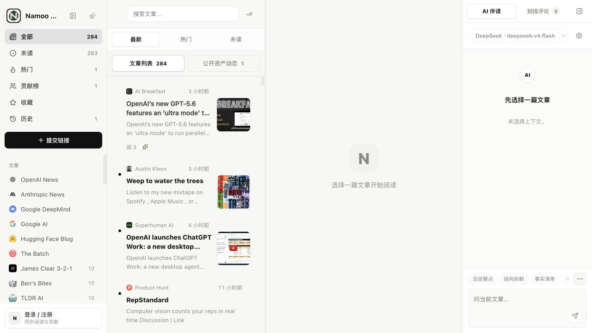
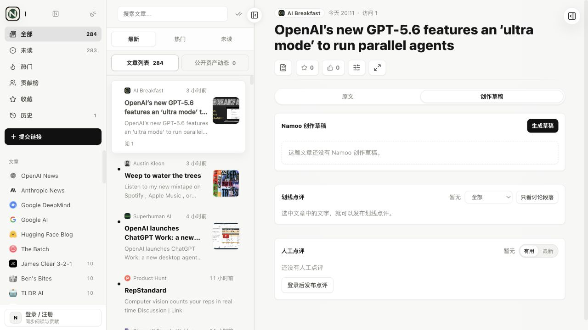
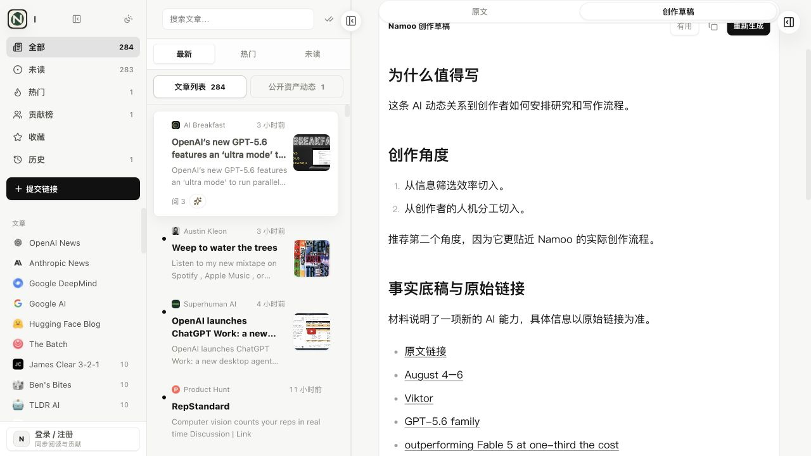

# Namoo Reader

Namoo Reader 是大月 Namoo 的个人 RSS 阅读与创作工作台。它把 AI 官方动态、研究文章、产品资讯和创作类内容收进同一个阅读器，也把读完文章后的选题、事实整理和初稿准备放在同一条链路里。

[在线站点](https://rss.namooca.com) · [快速开始](#快速开始) · [信息源管理](#信息源管理) · [部署](#docker-compose-部署) · [API](#api)



## 现在能做什么

- 聚合直连 RSS、RSSHub、sitemap、Hacker News、Product Hunt、GitHub Trending 和 Hugging Face Papers。
- 按文章、资讯、播客浏览，支持最新、热门、未读、收藏、历史和搜索。
- 阅读原文，生成中文翻译，在文章上下文里和 AI 对话。
- 生成 Namoo 创作草稿，保留事实和原始链接，并标出需要本人补充的体验、判断和情绪。
- 给信息源设置标签、编辑优先级、启用状态和侧边栏顺序。
- 把翻译、创作草稿、点评、划线和文章对话沉淀为可分享的公开资产。



## 从阅读到创作草稿

创作草稿不是可直接发布的成稿。每次生成固定包含六部分：

1. 为什么值得写
2. 创作角度
3. 事实底稿与原始链接
4. Namoo 风格草稿
5. 需要 Namoo 补充
6. 发布前检查

模型不能替大月编造试用经历、调查过程、个人情绪或第一人称判断。材料没有这些内容时，草稿会留下 `[需要 Namoo 补充：具体内容]`。最终观点和真人细节仍由作者完成。



## 信息源管理

仓库保留上游的 61 个信息源，并加入 OpenAI、Anthropic、Google DeepMind、Google AI、Hugging Face Blog、The Batch 和 Meta AI Blog 等 Namoo 核心候选源。

每个信息源有四组互不混用的状态：

- `enabled` 决定是否继续抓取，以及是否出现在普通侧边栏和默认信息流。
- `editorialPriority` 表示高、普通或低编辑优先级，供筛选和选题判断使用。
- `displayOrder` 保存左侧栏顺序，管理员可以在同一分类内上移或下移。
- `refreshPriority` 只影响抓取调度频率，不代表内容价值。

来源定义保存在 `lib/sources.js`，个人启用状态、编辑优先级和顺序保存在 SQLite。关闭来源不会删除历史文章，深层链接仍然可访问。

RSSHub 实例通过 `RSSHUB_INSTANCES` 配置。应用仍是一个容器，RSSHub 使用远程公共实例，不需要额外启动 RSSHub 容器。

## 快速开始

需要 Node.js 22 或更高版本。项目使用 Node 内置 SQLite。

```bash
git clone https://github.com/nardinmarcus/rssreader.git
cd rssreader
npm ci
cp .env.example .env
npm start
```

默认访问地址是 `http://localhost:8080`。如果需要管理员账号，在 `.env` 里填写：

```dotenv
ADMIN_EMAIL=you@example.com
ADMIN_PASSWORD=replace-with-a-strong-password
ADMIN_NAME=大月 Namoo
```

服务首次启动时会用这组配置创建管理员；后续启动只维护管理员身份和公开名称，不会覆盖在网页中修改过的密码。不要把 `.env`、SQLite、缓存和日志提交到 Git。

## AI 配置

服务端支持 DeepSeek 和兼容 OpenAI 接口的供应商：

```dotenv
DEEPSEEK_API_KEY=
DEEPSEEK_MODEL=deepseek-v4-flash
DEEPSEEK_BASE_URL=https://api.deepseek.com/v1
```

`DEEPSEEK_*`（或 `AI_*`）是站点默认 AI：手动翻译、创作草稿、文章对话和后台自动草稿会共用它。登录用户也可以在个人后台保存自己的 AI profile 作为覆盖；用户提供的 key 保存在浏览器 localStorage，请只在可信设备上使用。

没有可用 AI key 时，RSS 抓取和原文阅读仍然工作，翻译、创作草稿和文章对话会提示先配置模型。

## 环境变量

| 变量 | 默认值 | 作用 |
| --- | --- | --- |
| `HOST` | `0.0.0.0` | Node 监听地址 |
| `PORT` | `8080` | Node 监听端口 |
| `SITE_URL` | `https://rss.namooca.com` | 公开站点地址和统计域名 |
| `ADMIN_EMAIL` | 空 | 管理员邮箱 |
| `ADMIN_PASSWORD` | 空 | 首次创建管理员时使用的引导密码 |
| `ADMIN_NAME` | `大月 Namoo` | 管理员公开名称 |
| `COOKIE_SECURE` | 空 | 设置为 `1` 时只通过 HTTPS 发送 session cookie |
| `RSSHUB_INSTANCES` | 三个公共实例 | 逗号分隔的 RSSHub 地址，按顺序回退 |
| `STARTUP_REFRESH_DELAY_MS` | `30000` | 启动后首次全量刷新延迟，`-1` 表示关闭 |
| `FRESHNESS_SWEEP_INTERVAL_MS` | `300000` | 增量新鲜度扫描间隔，`-1` 表示关闭 |
| `NEWS_REFRESH_INTERVAL_MS` | `1800000` | 资讯默认刷新间隔 |
| `ARTICLE_REFRESH_INTERVAL_MS` | `7200000` | 文章默认刷新间隔 |
| `PODCAST_REFRESH_INTERVAL_MS` | `21600000` | 播客默认刷新间隔 |
| `AUTO_REWRITE_SOURCE_IDS` | 空 | 限定自动生成草稿的信息源 |
| `UMAMI_SRC` | 空 | 可选 Umami 脚本地址 |
| `UMAMI_WEBSITE_ID` | 空 | 可选 Umami 站点 ID |
| `NAMOO_READER_DATA_DIR` | `./data` | 测试或自定义运行数据目录 |

只有 `UMAMI_SRC` 和 `UMAMI_WEBSITE_ID` 同时有效时，页面才会加载 Umami。默认配置不会向任何统计服务发送请求。

## Docker Compose 部署

```bash
cp .env.example .env
docker compose up -d --build
docker compose logs -f namoo-reader
```

Compose 只运行一个 `namoo-reader` 容器：

- 宿主机端口：`127.0.0.1:3088`
- 容器端口：`8080`
- 持久化目录：`./data:/app/data`
- 重启策略：`unless-stopped`

当前数据库文件仍叫 `data/qmreader.sqlite`，这是为了让现有部署原地升级并保留回滚能力。它只是兼容文件名，不代表产品品牌。

生产站点建议由 Caddy、Nginx 或 OpenResty 负责 HTTPS，再反向代理到 `127.0.0.1:3088`。

## 数据迁移

旧版本把信息源启停覆盖写在 `data/state.json`。新版本启动时会把这些值一次性导入 SQLite，使用 `INSERT OR IGNORE`，不会覆盖之后在后台做的新设置。

迁移完成后，SQLite 是个人设置的事实来源。`state.json` 只作为旧数据证据保留，不再被写入。

## API

| 方法 | 路径 | 说明 |
| --- | --- | --- |
| `GET` | `/api/sources` | 匿名用户获取启用源；管理员获取全部源和管理状态 |
| `PATCH` | `/api/sources/:id` | 管理员修改启用状态或编辑优先级 |
| `POST` | `/api/sources/:id/move` | 管理员在同一分类内上移或下移 |
| `POST` | `/api/refresh` | 登录用户刷新当前源，管理员刷新全部源 |
| `GET` | `/api/entries?source=&category=&q=&limit=` | 获取文章列表 |
| `GET` | `/api/entry/:id` | 获取单篇文章 |
| `GET` | `/api/entry/:id/translation` | 获取中文翻译 |
| `GET` | `/api/entry/:id/rewrite` | 获取 Namoo 创作草稿，保留旧路径兼容 |
| `POST` | `/api/entry/:id/rewrite` | 生成或更新 Namoo 创作草稿 |
| `GET` | `/assets` | 浏览公开资产 |
| `GET` | `/assets.xml` | 订阅公开资产 RSS |

## 验证

```bash
npm test
node --check server.js lib/*.js scripts/*.js public/app.js
npm audit --omit=dev
docker compose config
docker build -t namoo-reader:test .
```

新增信息源可以在隔离数据目录中做真实抓取，不触发 AI：

```bash
NAMOO_READER_DATA_DIR="$(mktemp -d)" \
  node scripts/refresh-worker.js \
  --kind=refresh \
  --fetch-only=1 \
  --sources=openai,anthropic,google-deepmind,google-ai,huggingface-blog,the-batch
```

## 安全边界

- 不要把服务器 `.env`、用户 AI key、SQLite、缓存和日志公开。
- 用户 AI key 从浏览器发送到 Namoo Reader 后端，再由后端请求供应商。
- 公开翻译、创作草稿、点评、划线和文章对话可能进入公开资产页，不要写入私密内容。
- AI base URL 必须使用 HTTPS，并且不能指向 localhost 或私有网段。

安全问题请按 [SECURITY.md](SECURITY.md) 私下报告。

## 上游归属

Namoo Reader 基于向阳乔木维护的 QMReader 修改。上游部署记录保留在 `ops/`，并在 [ops/README.md](ops/README.md) 里标明历史边界。项目保留原 MIT 版权，同时记录大月 Namoo 的修改归属。

## License

MIT，详见 [LICENSE](LICENSE)。

## English

Namoo Reader is a self-hosted RSS reading and creation workspace for AI-focused research and writing. It keeps source management, reading, translation, article chat, and a human-in-the-loop creation draft in one container. The draft preserves facts and links, while explicitly marking first-hand experience and personal judgment that only the author can provide.
