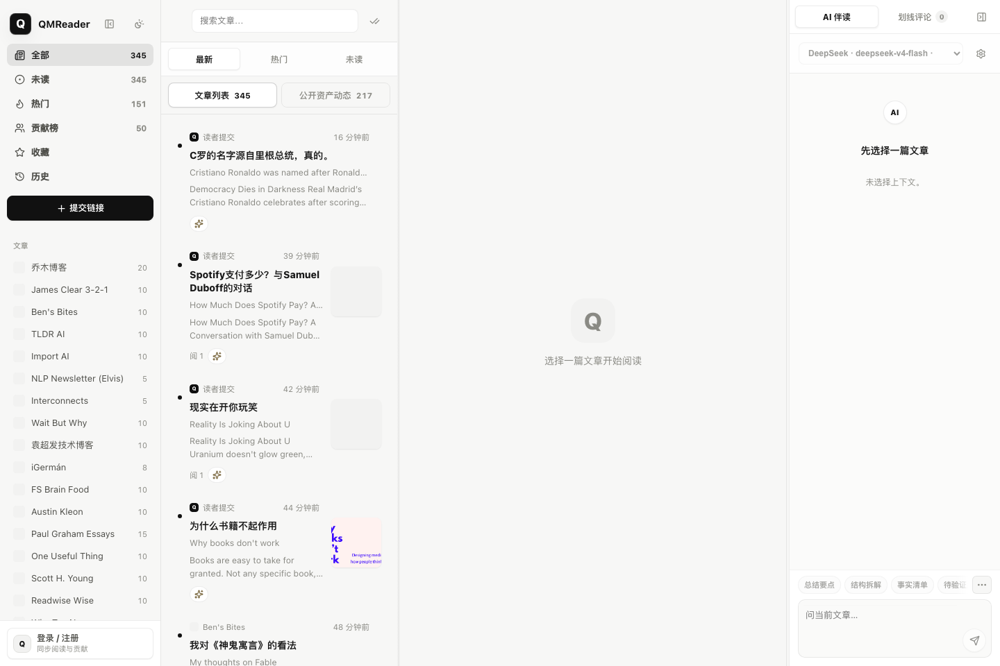
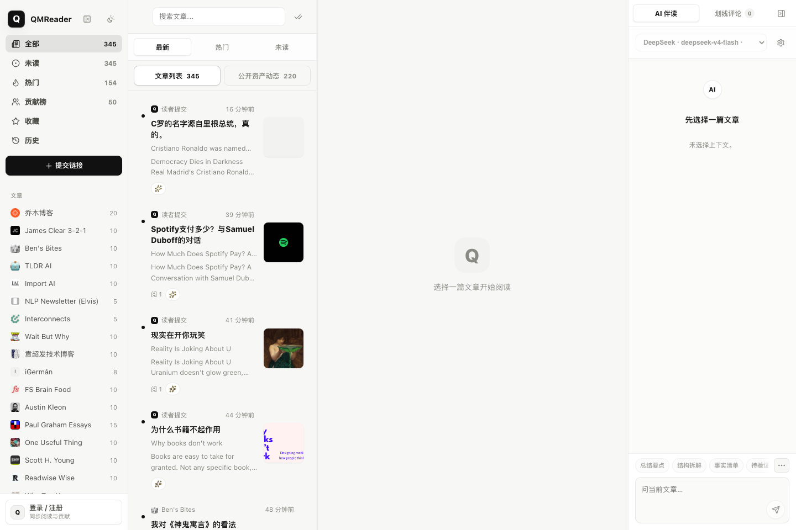
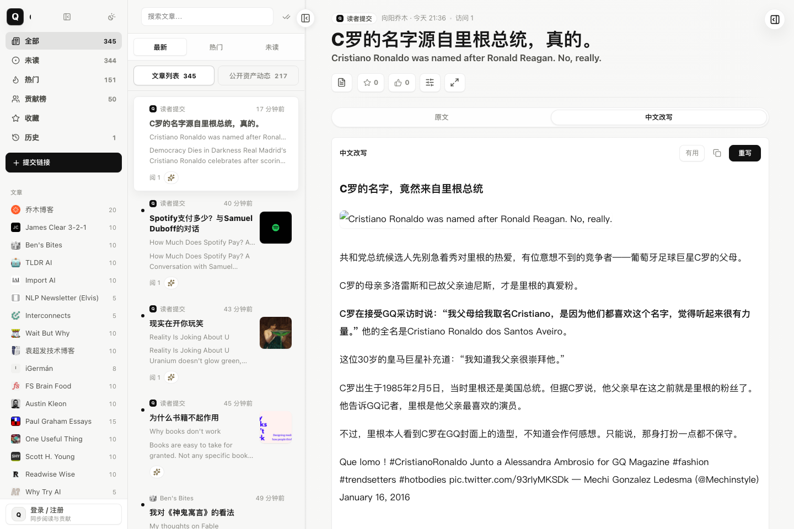

# QMReader

**中文** | [English](#english)

把 RSS 阅读、双语翻译、乔木风格改写、人工点评和文章上下文 AI 对话放在一个自托管阅读工作台里。

QMReader is a self-hosted RSS reading workbench that turns feeds into bilingual titles, rewrites, comments, and reusable public reading assets.

[在线体验](https://rss.qiaomu.ai) · [产品巡游](#产品巡游) · [快速开始](#快速开始) · [部署](#部署) · [API](#api) · [License](#license)



**已验证:** 2026-07-07，`node --check server.js lib/background-jobs.js lib/sources.js scripts/refresh-worker.js public/app.js`，公开站点 `https://rss.qiaomu.ai/api/sources` 返回 61 个信息源；README 截图来自正式站点 `rss.qiaomu.ai` 当前 UI。

## 这是什么

QMReader 是向阳乔木自用的 RSS 阅读器。它不是一个通用新闻门户，而是面向技术内容阅读、AI 辅助消化和公开知识资产沉淀的工作台：

- 订阅 RSSHub、直接 RSS、sitemap 和少量定制抓取源。
- 抓取后自动补英文标题中文翻译。
- 支持把文章翻译、改写成乔木风格中文稿，并保存为可分享的公开资产。
- 支持人工点评、文章上下文 AI 对话、贡献者页、公开资产目录和 RSS。
- 刷新机制把“快速 RSS 抓取”和“慢速 AI 改写”拆开，让新条目先出现，AI 后台补齐。

生产站点运行在 [rss.qiaomu.ai](https://rss.qiaomu.ai)，代码可以自托管。站点服务端需要自己的 DeepSeek 或 OpenAI-compatible API key；示例配置只包含空值，不包含任何真实密钥。

## 为什么值得用

常见 RSS 阅读器只解决“订阅和打开”。QMReader 解决的是另一个问题：每天技术内容太多，读完之后很难留下可复用资产。

它把阅读过程拆成几个可沉淀的动作：

- **先快后慢:** 新 RSS 条目先进入列表，AI 翻译和改写慢慢补齐。
- **先读后加工:** 原文、中文翻译、乔木风格改写并排存在同一篇文章下。
- **先个人后公开:** 登录用户的翻译、改写、点评、对话可以变成公开资产，后续被搜索、RSS、贡献者页复用。
- **先站点后自托管:** 你可以直接看正式站，也可以拿代码部署自己的阅读工作台。

## 产品巡游

### 首页和文章列表

左侧是信息源与阅读视图，中央是可搜索、可按最新/热门/未读切换的文章列表，右侧保留当前文章上下文的 AI 伴读区。未选择文章时，界面保持轻量，不把 AI 对话或调试状态推到阅读前面。



### 阅读器、中文改写和 AI 伴读

文章详情页把原文、中文改写、中文翻译、划线点评、人工点评和 AI 伴读放在同一条阅读链路中。下面这张图来自正式站点的真实文章深链，左边仍保留列表上下文，中间展示中文改写，右边是 Article Agent。



### 公开资产

QMReader 会把可复用内容做成公开资产，而不是只留在个人会话里：

- 翻译和改写有稳定深链。
- 人工点评、划线点评、文章对话可被单条引用。
- `/assets`、`/assets.xml`、`/assets/rewrite.xml` 等目录和 RSS 让后续读者订阅资产流。
- `/contributors/:id` 和 `/contributors/:id.xml` 展示某个贡献者沉淀过的公开内容，不暴露邮箱。

### 管理和刷新

后台刷新分成 fetch worker 和 AI worker。fetch worker 只负责把最新 RSS 先抓回来并落盘，AI worker 再按有新条目的源补标题翻译和自动改写。这样即使 DeepSeek 或其他模型变慢，读者也可以先看到新文章。

## 核心能力

| 能力 | 用户得到什么 |
|---|---|
| 多源 RSS 抓取 | 聚合 RSSHub、直接 RSS、sitemap、Hacker News、Product Hunt、GitHub Trending、Hugging Face Papers 等技术源 |
| 首页工作台 | 源列表、文章列表、阅读器、Article Agent 四区同屏，适合连续阅读和快速切换上下文 |
| 文章列表 | 支持最新、热门、未读、搜索、源筛选、收藏、历史和贡献榜视图 |
| 双语阅读 | 英文标题自动补中文，正文可生成中文译文，并保留原文上下文 |
| 乔木风格改写 | 对文章、论文、Hacker News 讨论、Product Hunt 官网材料做中文改写 |
| Hacker News 增强 | 使用 HNRSS 组合高价值 HN feed，并把讨论摘录和作者回复纳入阅读材料 |
| 公开阅读资产 | 翻译、改写、点评、划线、对话都有稳定深链、贡献者页和 RSS |
| 贡献者体系 | 公开贡献者页按资产、改写、点评、对话和有用反馈聚合，不暴露邮箱 |
| AI 伴读 | 当前文章右侧可做总结要点、结构拆解、事实清单、待验证点等上下文对话 |
| 快速刷新 | RSS fetch 先落盘并通知 Web 进程，标题翻译和自动改写后置到 AI worker |
| 安全的用户 AI 配置 | 用户 API key 存在浏览器 localStorage，不写入服务器数据库 |
| 自托管部署 | 支持 Node + systemd，也支持 Docker Compose；SQLite 存储运行数据 |

## 快速开始

```bash
npm install
cp .env.example .env
npm start
```

默认监听 `http://localhost:8080`。如果只想本地监听：

```bash
HOST=127.0.0.1 PORT=3000 npm start
```

首次启动会按 `STARTUP_REFRESH_DELAY_MS` 决定是否触发全量刷新。运行数据写入 `data/`，包括 RSS 缓存、SQLite 数据库、截图和日志；这些文件默认被 `.gitignore` 排除。

## 配置

`.env.example` 只给变量名和公开默认值，不包含真实密钥。常用变量：

| 变量 | 默认值 | 说明 |
|---|---|---|
| `DEEPSEEK_API_KEY` | 空 | 服务端 DeepSeek API key，用于标题翻译和默认改写 |
| `DEEPSEEK_MODEL` | `deepseek-v4-flash` | 服务端默认标题翻译和中文改写模型 |
| `DEEPSEEK_BASE_URL` | `https://api.deepseek.com/v1` | DeepSeek OpenAI-compatible API 地址 |
| `AI_PROVIDER` | `deepseek` | 备用服务端 provider 名称 |
| `AI_API_KEY` | 空 | 非 DeepSeek provider 的服务端 key |
| `AI_BASE_URL` | 空 | 非 DeepSeek provider 的 OpenAI/Anthropic-compatible base URL |
| `AI_MODEL` | 空 | 非 DeepSeek provider 的模型名 |
| `ADMIN_EMAIL` | 空 | 管理员登录邮箱 |
| `ADMIN_PASSWORD` | 空 | 管理员登录密码，重启时会同步更新 |
| `ADMIN_NAME` | `向阳乔木` | 管理员公开显示名 |
| `COOKIE_SECURE` | 空 | 设为 `1` 时强制 session cookie 使用 Secure |
| `HOST` | `0.0.0.0` | Node 监听地址 |
| `PORT` | `8080` | Node 监听端口 |
| `STARTUP_REFRESH_DELAY_MS` | `30000` | 启动后延迟多少毫秒触发首次全量刷新；`-1` 表示禁用 |
| `FRESHNESS_SWEEP_INTERVAL_MS` | `300000` | 轻量增量检查轮询间隔 |
| `FRESHNESS_STARTUP_DELAY_MS` | `120000` | 启动多久后开始第一次轻量增量检查 |
| `FRESHNESS_SWEEP_BATCH_SIZE` | `3` | 每次 freshness sweep 最多刷新几个过期源 |
| `FRESHNESS_SWEEP_MAX_COST` | `6` | 每次 freshness sweep 的源成本上限 |
| `NEWS_REFRESH_INTERVAL_MS` | `1800000` | `news` 分类源默认检查间隔 |
| `ARTICLE_REFRESH_INTERVAL_MS` | `7200000` | `article` 分类源默认检查间隔 |
| `PODCAST_REFRESH_INTERVAL_MS` | `21600000` | `podcast` 分类源默认检查间隔 |
| `SOURCE_INTERACTION_REFRESH_COOLDOWN_MS` | `300000` | 打开文章或切换频道触发后台刷新时的同源冷却时间 |
| `TITLE_TRANSLATION_LIMIT` | `80` | 单轮标题翻译上限 |
| `AUTO_REWRITE_SOURCE_IDS` | 空 | 限定自动改写源；空值表示启用源中可改写的内容 |
| `AUTO_REWRITE_LIMIT_PER_SOURCE` | `3` | 每个源默认自动改写条数 |
| `AUTO_REWRITE_LIMIT_HACKERNEWS` | `10` | Hacker News 自动改写条数 |
| `AUTO_REWRITE_MODEL` | `deepseek-v4-flash` | 自动改写模型 |
| `UMAMI_WEBSITE_ID` | 空 | 可选 Umami 站点 ID |
| `UMAMI_SRC` | `https://umami.qiaomu.ai/script.js` | 可选 Umami 脚本地址 |

## 账号与权限

| 角色 | 权限 |
|---|---|
| 游客 | 浏览文章、公开翻译、公开改写、公开点评和公开文章对话 |
| 注册用户 | 发布点评，生成并保存翻译/改写，围绕当前文章对话，管理自己的公开资产 |
| 管理员 | 手动刷新、启用/禁用信息源、触发标题补翻译、管理源状态 |

注册只校验邮箱格式和密码长度，不做邮件验证码。管理员账号通过环境变量 seed。

## AI 与隐私边界

- 服务端 key 只从 `.env` / `.env.local` / 环境变量读取，不会下发到浏览器。
- 用户在页面里配置的 AI provider/API key 保存在浏览器 localStorage，不写入 SQLite。
- 文章对话、模型列表和连接测试会把用户 key 随请求发送到本站后端代理调用。
- Base URL 必须是公开 `https://` 地址，服务端会拒绝本机和内网地址，降低 SSRF 风险。
- 运行数据在 `data/qmreader.sqlite` 和 `data/cache.json`，默认不提交到 Git。
- 公开贡献内容会显示在资产页、贡献者页、sitemap 和 RSS；不要在公开点评或对话里写私密信息。

## 刷新机制

QMReader 的刷新分两段：

1. **Fetch worker:** 抓 RSS/页面，写入缓存和 SQLite，并立刻通知 Web 进程重新加载。用户先看到新条目。
2. **AI worker:** 只对有新条目的源排队做标题翻译和自动改写。AI 慢或失败时，不阻塞 RSS 阅读。

不同源有不同 freshness 策略。例如 Hacker News 5 分钟高优先级，Product Hunt 15 分钟，GitHub/Hugging Face 30 分钟，播客类 12 小时。`/api/sources` 会返回 `backgroundJob.fetch` 和 `backgroundJob.ai`，便于观察两段任务状态。

命令行手动刷新：

```bash
npm run refresh:worker
node scripts/refresh-worker.js --kind=auto-rewrite --sources=hackernews
```

## 信息源

信息源在 `lib/sources.js` 里配置。示例：

```js
{
  id: 'my-source',
  name: '我的源',
  category: 'article',
  siteUrl: 'https://example.com',
  enabled: true,
  limit: 10,
  feeds: [
    'https://example.com/feed',
    '{rsshub}/some/route',
    'sitemap:https://example.com/sitemap.xml',
  ],
}
```

支持三类候选地址：

| 写法 | 说明 |
|---|---|
| 普通 URL | 直接按 RSS/Atom 解析 |
| `{rsshub}/route` | 依次尝试内置 RSSHub 实例 |
| `sitemap:URL` | 抓 sitemap.xml 取最新文章页，再解析页面 og 标签 |

## API

常用公开接口：

| 方法 | 路径 | 说明 |
|---|---|---|
| GET | `/api/sources` | 全部源及抓取状态、刷新进度、fetch/AI 后台状态 |
| GET | `/api/entries?source=&category=&q=&limit=` | 文章列表 |
| GET | `/api/entry/:id` | 单篇全文 |
| GET | `/api/entry/:id/translation` | 读取双语翻译缓存 |
| GET | `/api/entry/:id/rewrite` | 读取乔木风格改写 |
| GET | `/api/entry/:id/comments` | 读取公开人工点评 |
| GET | `/api/entry/:id/chat` | 读取公开文章对话 |
| GET | `/assets` | 公开资产网页目录 |
| GET | `/assets.xml` | 公开资产 RSS |
| GET | `/contributors` | 公开贡献者目录 |
| GET | `/contributors/:id.xml` | 贡献者公开资产 RSS |
| GET | `/llms.txt` | 站点定位、公开目录、RSS 和 sitemap 汇总 |

需要登录或管理员权限的接口包括生成翻译/改写、发布点评、文章对话、刷新源、启用/禁用源等。详见 `server.js` 路由。

## 部署

### systemd 推荐路径

```bash
rsync -az --delete \
  --exclude node_modules \
  --exclude .git \
  --exclude data \
  --exclude .env \
  ./ user@server:/opt/qmreader/

ssh user@server 'cd /opt/qmreader && bash scripts/install-systemd-service.sh'
```

安装脚本会执行 `npm ci --omit=dev`，写入 systemd unit，并默认监听 `HOST=127.0.0.1`、`PORT=3088`。公开访问建议由 Nginx/Caddy 反代 HTTPS。

常用命令：

```bash
systemctl status qmreader
journalctl -u qmreader -n 100 --no-pager
systemctl restart qmreader
```

### Docker Compose

```bash
cp .env.example .env
docker compose up -d --build
```

默认容器内端口 `8080`，宿主机私有端口 `127.0.0.1:3088`。

## 项目结构

```text
server.js                  Express 入口、API、调度器、静态托管
lib/sources.js             信息源注册表和刷新策略
lib/fetcher.js             RSS/RSSHub/sitemap/页面抓取和缓存
lib/background-jobs.js     后台刷新、标题翻译、自动改写 worker 逻辑
lib/deepseek.js            AI provider、翻译、改写、对话调用
lib/store.js               SQLite schema 和数据访问
public/                    静态前端
scripts/                   systemd 安装脚本和 refresh worker
ops/                       部署记录
data/                      运行时数据，默认不提交
```

## 验证

```bash
node --check server.js
node --check lib/background-jobs.js
node --check lib/sources.js
node --check scripts/refresh-worker.js
node --check public/app.js
npm run refresh:worker
```

发布前额外做过：

- tracked HEAD 文件 secret 扫描，无 API key/token/private key 命中。
- Git 历史 `git grep -l` secret 模式扫描，无命中。
- `data/`、`node_modules/`、`.env`、`.env.local` 默认被排除。
- live API `https://rss.qiaomu.ai/api/sources` 返回 61 个信息源。

## 已知限制

- 某些站点会被 Cloudflare 或反爬策略拦截，无法稳定抓取。
- AI 生成质量依赖外部 provider，可能遇到限流、模型变更或费用问题。
- 默认 SQLite 适合个人/小团队自托管，不是高并发多租户服务。
- 注册没有邮件验证，不适合直接作为开放社区账号系统。
- Google S2 favicon 在部分网络环境不可用，会回退到字母图标。
- GitHub social preview 暂未自动配置，需要仓库发布后在 GitHub Settings 手动上传。

## 贡献

这个项目目前首先服务向阳乔木自己的阅读工作流，也欢迎围绕 RSS 源、部署文档、隐私边界和 bug 修复提交 PR。请先阅读 [CONTRIBUTING.md](CONTRIBUTING.md) 和 [SECURITY.md](SECURITY.md)。

## 关于向阳乔木

- 官网：[qiaomu.ai](https://qiaomu.ai)
- 博客：[blog.qiaomu.ai](https://blog.qiaomu.ai)
- 推荐：[tuijian.qiaomu.ai](https://tuijian.qiaomu.ai)
- X：[@vista8](https://x.com/vista8)
- GitHub：[@joeseesun](https://github.com/joeseesun)
- 微信公众号：向阳乔木推荐看

## License

MIT License. See [LICENSE](LICENSE).

---

<a name="english"></a>

# English

QMReader is a self-hosted RSS reading workbench by Qiaomu. It combines feed aggregation, bilingual title translation, Chinese article rewriting, public comments, and article-context AI conversations into one quiet reader interface.


## What You Get

- RSSHub, direct RSS, sitemap, Hacker News, Product Hunt, GitHub Trending, Hugging Face Papers, and other technical sources.
- A fast refresh pipeline: RSS fetches land first; AI translation/rewrite work runs separately in the background.
- Public reading assets: translations, rewrites, comments, chats, contributor pages, RSS feeds, and stable deep links.
- A static frontend served by Express, with SQLite for runtime data.
- Server-side DeepSeek/OpenAI-compatible support, plus user-provided browser-side AI profiles.

## Product Tour

### Source And Article List

The default workspace keeps source navigation, search, latest/hot/unread list modes, the reader pane, and the article agent visible at the same time.


### Reader, Chinese Rewrite, And Article Agent

The reader keeps the original article, Chinese rewrite, translation, annotations, comments, and article-context AI chat under the same entry.


### Public Assets

Translations, rewrites, comments, annotations, and article chats can become public reading assets with stable links, contributor pages, sitemap entries, and RSS feeds.

## Feature Map

| Feature | Result |
|---|---|
| Multi-source feed fetching | Aggregate RSSHub routes, direct feeds, sitemap pages, Hacker News, Product Hunt, GitHub Trending, and more |
| Reader workbench | Keep source list, article list, reader, and Article Agent in one screen |
| Bilingual reading | Translate English titles and generate Chinese article translations |
| Qiaomu-style rewrites | Rewrite articles, papers, HN discussion material, and Product Hunt product context into readable Chinese |
| Public reading assets | Turn translations, rewrites, comments, annotations, and chats into stable public links and RSS |
| Split refresh pipeline | Show new RSS entries first, then run AI title translation/rewrite in a separate worker |
| User AI profiles | Store user-provided API keys in browser localStorage instead of the server database |
| Self-hosting | Run with Node/systemd or Docker Compose; store runtime data in SQLite |

## Try It

Live demo: [rss.qiaomu.ai](https://rss.qiaomu.ai)

```bash
npm install
cp .env.example .env
npm start
```

Open `http://localhost:8080`.

To run locally only:

```bash
HOST=127.0.0.1 PORT=3000 npm start
```

## Configuration

Copy `.env.example` to `.env` and fill in your own keys. The repository does not contain production API keys.

Important variables:

- `DEEPSEEK_API_KEY`: server-side key for title translation and default rewriting.
- `DEEPSEEK_MODEL`: default `deepseek-v4-flash`.
- `ADMIN_EMAIL` / `ADMIN_PASSWORD`: admin account seed.
- `HOST` / `PORT`: HTTP bind address and port.
- `STARTUP_REFRESH_DELAY_MS`: startup refresh delay, or `-1` to disable.
- `FRESHNESS_SWEEP_INTERVAL_MS`: stale-source sweep interval.
- `AUTO_REWRITE_SOURCE_IDS`: optional source allowlist for auto rewriting.

Runtime data is stored under `data/` and is ignored by Git.

## Privacy And Security

- Server API keys are read from env files or environment variables only.
- User-configured AI keys are kept in browser localStorage and are not stored in SQLite.
- Public contributions are intentionally public through asset pages, contributor pages, sitemap, and RSS.
- AI base URLs must be public HTTPS URLs; localhost and private network addresses are rejected.
- Report vulnerabilities through the process in [SECURITY.md](SECURITY.md).

## Deployment

Recommended production shape:

1. Run Node on a private host/port, for example `127.0.0.1:3088`.
2. Put Nginx or Caddy in front for HTTPS.
3. Keep `.env` and `data/` on the server only.

```bash
rsync -az --delete \
  --exclude node_modules \
  --exclude .git \
  --exclude data \
  --exclude .env \
  ./ user@server:/opt/qmreader/

ssh user@server 'cd /opt/qmreader && bash scripts/install-systemd-service.sh'
```

Docker Compose is also available:

```bash
cp .env.example .env
docker compose up -d --build
```

## Verification

```bash
node --check server.js
node --check lib/background-jobs.js
node --check lib/sources.js
node --check scripts/refresh-worker.js
node --check public/app.js
```

Before public release, tracked files and Git history were scanned for common API key/token/private key patterns. No matches were found.

## Limits

- External websites may block scraping.
- AI output depends on your provider, quota, and model behavior.
- SQLite is intended for small self-hosted use, not a large multi-tenant SaaS.
- Account registration has no email verification.
- The GitHub social preview image is a manual follow-up after publication.

## Maintainer

Maintained by 向阳乔木:

- [qiaomu.ai](https://qiaomu.ai)
- [blog.qiaomu.ai](https://blog.qiaomu.ai)
- [tuijian.qiaomu.ai](https://tuijian.qiaomu.ai)
- X [@vista8](https://x.com/vista8)
- GitHub [@joeseesun](https://github.com/joeseesun)

MIT License.
