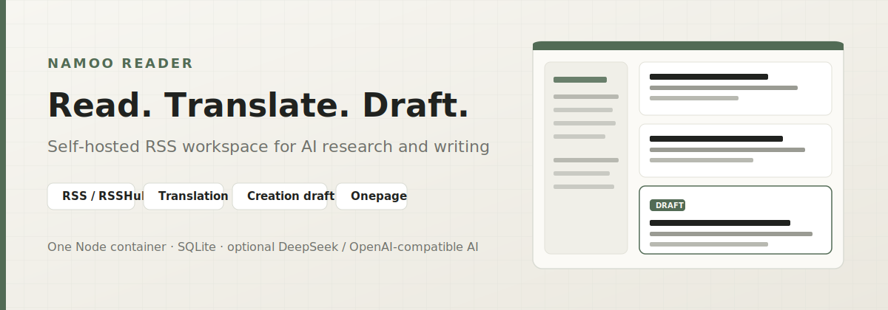

# Namoo Reader

[English](README.md) | [简体中文](README.zh-CN.md)

<div align="center">



**Self-hosted RSS reading and creation workspace for AI research and writing.**

[Live site](https://rss.namooca.com) · [Security](SECURITY.md) · [License](LICENSE)

</div>

Namoo Reader pulls AI product news, research papers, and writing-relevant feeds into one reader, then keeps the path from reading to translation, chat, and a human-in-the-loop creation draft inside a single Node container with SQLite.


## Quick start

Requires **Node.js 22+** (uses built-in `node:sqlite`). Lockfile: `package-lock.json` → use **npm**.

```bash
git clone https://github.com/nardinmarcus/rssreader.git
cd rssreader
npm ci
cp .env.example .env
node --env-file=.env server.js
```

Open [http://localhost:8080](http://localhost:8080).

Optional admin bootstrap in `.env` (created only on first start; later boots do not overwrite a password changed in the UI):

```dotenv
ADMIN_EMAIL=you@example.com
ADMIN_PASSWORD=replace-with-a-strong-password
ADMIN_NAME=Namoo
```

> [!IMPORTANT]
> **Data:** runtime state lives under `./data` (SQLite `data/qmreader.sqlite`, optional `raw/` snapshots). Do not commit `.env`, SQLite/WAL, caches, or logs.
> **Network:** the app fetches public feeds and, when configured, calls your AI provider over HTTPS. Submitted links do no DNS/HTTP/AI work until an admin approves them.
> **AI keys:** server keys stay in env. User BYOK keys live in browser `localStorage` and are sent only to this backend for provider calls. Use only on trusted devices.

### Docker Compose

```bash
cp .env.example .env
docker compose up -d --build
docker compose logs -f namoo-reader
```

- One service: `namoo-reader`
- Host: `127.0.0.1:3088` → container `8080`
- Volume: `./data:/app/data`
- Image base: `node:26-slim`

Put Caddy, Nginx, or OpenResty in front for HTTPS. PWA install needs a secure context; keep `/manifest.webmanifest` and `/sw.js` reachable and not long-cached over the app's `Cache-Control: no-cache`.

## What it does

Most RSS tools stop at the feed list. Namoo Reader is built for a read → understand → draft loop:

1. Aggregate feeds (direct RSS, RSSHub, sitemap, Hacker News, Product Hunt, GitHub Trending, Hugging Face Papers, and more).
2. Read full articles with unread / starred / history / search.
3. Translate, chat in article context, and generate a six-part creation draft that keeps facts and source links, and marks gaps the human author must fill.
4. Optionally publish immutable Onepages and shareable public assets when rollout flags allow.

RSS and original reading work without AI keys. Translation, drafts, Onepage, and article chat need a configured model.


## Features

- **Multi-source ingestion**: direct RSS/Atom, RSSHub routes, sitemap, and built-in adapters. Catalog: **77** sources in `lib/sources.js`, **54** enabled by default. Per-source enablement, editorial priority, and sidebar order live in SQLite.
- **Reading modes**: articles, news, podcasts; latest, popular, unread, starred, history, search.
- **AI assist (optional)**: Chinese translation, article chat, Namoo creation draft, Onepage (feature-flagged).
- **Creation draft contract**: six fixed sections; the model must not invent first-person experience, research process, or judgment. Missing material becomes `[需要 Namoo 补充：…]`.
- **Link submissions**: signed-in users submit URLs into an isolated moderation queue. Admins approve or reject; only then does fetch start. Plain pages become articles; RSS/Atom URLs create or revive custom sources.
- **Admin workspace**: source controls, submission queue, user search/filter, disable/restore with audited impact.
- **Public assets**: published translations, drafts, Onepages, notes, highlights, and chats can appear under `/assets` and `/assets.xml`.
- **PWA shell**: installable standalone window; Service Worker caches only the reading chrome, never articles or `/api/*`. Offline = shell only. See [ADR 0001](docs/adr/0001-pwa-installable-offline-shell.md).


## Configuration

Copy `.env.example` and fill what you need. Full defaults and comments live there.

| Variable | Default | Role |
| --- | --- | --- |
| `HOST` / `PORT` | `0.0.0.0` / `8080` | Listen address |
| `SITE_URL` | `https://rss.namooca.com` | Public site URL / analytics hostname |
| `ADMIN_EMAIL` / `ADMIN_PASSWORD` / `ADMIN_NAME` | empty / empty / `大月 Namoo` | First-boot admin bootstrap |
| `COOKIE_SECURE` | example `1` | Session cookies HTTPS-only when `1` |
| `DEEPSEEK_*` or `AI_*` | see `.env.example` | Server-funded AI (DeepSeek or OpenAI/Anthropic-compatible) |
| `RSSHUB_INSTANCES` | three public hubs | Comma-separated fallback list; no local RSSHub container |
| `VERSIONED_TRANSLATION_MODE` | `off` | `off` \| `shadow` \| `canary` \| `all` |
| `ONEPAGE_MODE` | `off` | `off` \| `admin` \| `all` |
| `NAMOO_READER_DATA_DIR` | `./data` | Data root (tests must use an isolated dir) |
| `UMAMI_SRC` / `UMAMI_WEBSITE_ID` | empty | Optional analytics; both must be valid or nothing is injected |

Without AI keys, feeds and reading still work; AI features prompt for configuration.

Server AI always uses server env for provider/model/key. Browser-supplied routing is accepted only for explicit user-owned keys (BYOK).

## Source management

Each source has four independent axes:

| Axis | Meaning |
| --- | --- |
| `enabled` | Fetch + default feed / sidebar visibility |
| `editorialPriority` | High / normal / low for editorial filters |
| `displayOrder` | Sidebar order within a category |
| `refreshPriority` | Fetch scheduler only; not content value |

Definitions live in `lib/sources.js`. Preferences live in SQLite. Disabling a source does not delete history; deep links remain.

## Creation draft shape

Every draft has the same six parts:

1. Why it is worth writing  
2. Angle  
3. Fact sheet and original links  
4. Namoo-style draft  
5. What Namoo must still add  
6. Pre-publish checklist  

Final voice and lived detail stay with the human author.

## Rollouts and ops

<details>
<summary>Versioned translation pipeline</summary>

`VERSIONED_TRANSLATION_MODE` controls immutable document/translation writes:

| Mode | Behavior |
| --- | --- |
| `off` | Legacy path only; fastest software rollback (default) |
| `shadow` | Write immutable docs + raw evidence; translations still use legacy response, schema-1 versions stored for integrity |
| `canary` | Admin + `VERSIONED_TRANSLATION_CANARY_ENTRY_IDS` use V2; others stay legacy |
| `all` | All server-AI translations use V2 jobs and immutable versions |

BYOK always stays on the synchronous legacy path. Keys, endpoints, and tuning must not enter jobs, SQLite, or logs.

Before flipping modes: stop the container, backup `.env`, SQLite/WAL, and `raw/`. After deploy with `off`, run document then translation backfills, then:

```bash
node scripts/verify-versioned-pipeline.js --data-dir=data --read-only
```

Backfill helpers: `scripts/backfill-article-documents.js`, `scripts/backfill-translation-versions.js` (`--dry-run`, `--verify-only`, `--after-id` for resume). Application rollback: set mode `off` and recreate the container; versioned tables can remain.

</details>

<details>
<summary>Onepage boundaries</summary>

`ONEPAGE_MODE` only gates who may generate and publish. Cap: 20 generations per user per 24h. Each Onepage binds to a pinned `article_documents` version, starts private, and enters public assets / contributor pages / RSS / sitemap only after explicit publish. Aggregate onepage text is hard-capped at **1200** characters. Stale versions are marked when the source document changes; they are never silently overwritten.

</details>

<details>
<summary>Data migration notes</summary>

Older builds stored source enablement overrides in `data/state.json`. Startup imports them once with `INSERT OR IGNORE` and never overwrites later UI settings. SQLite is authoritative for articles, users, sessions, source prefs, moderation, versions, jobs, and published assets. `data/raw/` is evidence for versioned documents. `cache.json` / `state.json` and in-memory projections are rebuildable only.

The DB filename `qmreader.sqlite` is a compatibility name for in-place upgrades, not the product brand.

</details>

## Common API (not exhaustive)

| Method | Path | Notes |
| --- | --- | --- |
| `GET` | `/api/sources` | Enabled sources (admin: all + admin fields) |
| `PATCH` | `/api/sources/:id` | Admin: enablement / editorial priority |
| `POST` | `/api/sources/:id/move` | Admin: reorder in category |
| `POST` | `/api/refresh` | User: current source; admin: all |
| `POST` | `/api/submit-link` | Queue a link for moderation |
| `GET` | `/api/me` | Session, site AI, rollout capabilities |
| `POST` | `/api/auth/register` · `/login` · `/logout` | Session auth |
| `GET` | `/api/entries` | List without full body |
| `GET` | `/api/entry/:id` | Single entry |
| `GET`/`POST` | `/api/entry/:id/translation` | Read / generate translation |
| `GET` | `/api/translation-jobs/:jobId` | V2 job progress (authorized) |
| `GET`/`POST` | `/api/entry/:id/rewrite` | Creation draft |
| `GET`/`POST` | `/api/entry/:id/onepage` | Onepage versions |
| `POST` | `/api/onepages/:onepageId/publish` | Explicit publish |
| `GET` | `/api/admin/*` | Submissions, users, disable/restore |
| `GET` | `/assets` · `/assets.xml` | Public asset catalog and RSS |

## Development

```bash
npm ci
npm test
node --check server.js
find lib scripts -type f -name '*.js' -print0 | xargs -0 -n1 node --check
node --check public/app.js
npm audit --omit=dev
```

Fetch selected sources without AI (isolated data dir):

```bash
NAMOO_READER_DATA_DIR="$(mktemp -d)" \
  node scripts/refresh-worker.js \
  --kind=refresh \
  --fetch-only=1 \
  --sources=openai,anthropic,google-deepmind,google-ai,huggingface-blog,the-batch
```

`docker compose config` requires a local `.env`. Frontend assets: `public/index.html`, `public/app.js`, `public/styles.css` (asset query versions must match file hashes in tests).

## Security

- Do not expose server `.env`, user AI keys, SQLite, caches, or logs.
- Pending submissions perform no network or AI work before admin approval; approved fetches still block private addresses, unsafe redirects, and oversized bodies.
- Server AI ignores forged browser provider/model/key/base URL unless the request is explicit BYOK.
- AI base URLs must be HTTPS and non-private.
- Public assets may surface translations, drafts, Onepages, notes, highlights, and chats. Do not put secrets there.

Report vulnerabilities privately via [SECURITY.md](SECURITY.md).

## Architecture (short)

```text
Browser (vanilla JS PWA)
    │
    ▼
Express server.js  ── single container
    │
    ├── lib/sources.js     versioned catalog
    ├── SQLite             authoritative app state
    ├── data/raw/          immutable fetch evidence
    └── optional HTTPS AI  DeepSeek / compatible
```

Project rules and boundaries: [Agents.md](Agents.md). Upstream QMReader ops history: [ops/README.md](ops/README.md).

## Upstream and license

Based on [QMReader](https://github.com/joeseesun/qmreader) by 向阳乔木 (Joe), with modifications by 大月 Namoo. MIT; see [LICENSE](LICENSE).
